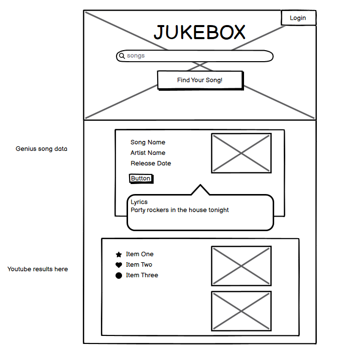
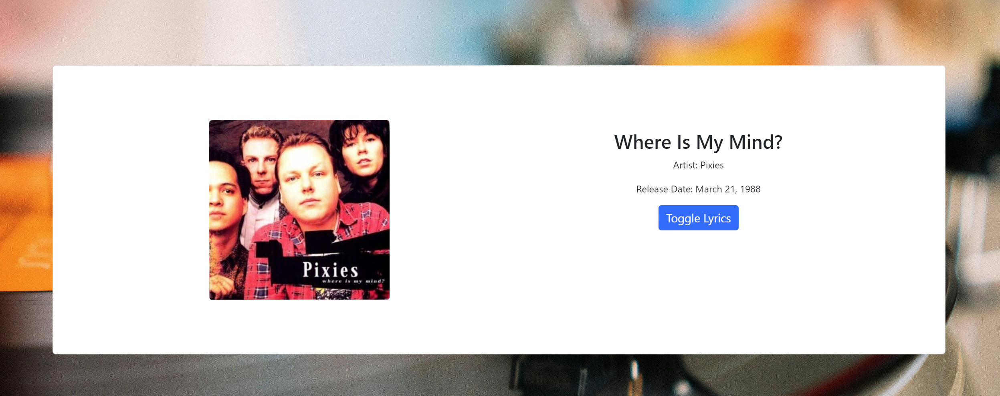

# Jukebox Hackathon Project

Jukebox is a site that aims to give music lovers a useful resource for finding information about their favorite songs. The site is targeted to fans of music who want immediate access to song lyrics, atist details, and music videos. Jukebox will be useful to anyone who wants a one-stop resource for lyrics and videos. 

Developed by William Waldron-Hyden, Patrick Walsh, and Jack Brosnan

## Features
# Existing features
- __Hero Image & Music Search Bar__
  - Featured in the hero image front and center, users can type in a song name that they want more information about. 
  - This input is connected to two APIs which will fetch two types of information which create site interactivity in the features outlined below. 
  - The hero image holds this search bar, catching the user's eye and calling them to action as soon as they see the screen. 

 
- __Song Info & Lyrics Section__
  - Below the search bar, a song info section will populate based on the user input. 
  - Using the Genius API, information such as song name, artist, release date, and album art will appear here.
  - This section includes an expandable card that holds the lyrics for the selected song. 
  - This section is fully responsive and provides a readable, enjoyable display on multiple devices. 

  

- __Music Video Section__
  - Below the lyrics section, a music video section will populate based on the same user input. 
  - Using the Youtube API, search results of music videos matching the user request will populate.
  - Clicking on a video causes a modal to appear which contains the video for viewing. 
  - A series of radio button toggles will allow for search refinement, so users can search for live shows, instrumentals, and other alternative forms,

  
  

### Features left to Implement
- __User Account Login__
  - User can log in to their personal account with the login button at the top of the screen. 
  - Currently there is no database implementation so this is a pseudo login with a single user, to demonstrate proof of concept. 

  - __User Account - Favorite songs__
  - While logged in, the user has the option to 'favorite' a song in the Song Info section. 
  - This sends the song info into an array, and the results of this can be viewed in a modal/popout section.
  - User can click on a song option, which will update the Search Bar input and populate the results in the Info/Video section.
  - Due to no database implementation, favorites are lost on refresh. Proof of concept.  

## Testing
We tested the API result population using a prefilled test card which would then be populated with the information. Due to limits on the public APIs used, we needed to repeatedly refresh the API keys. 

We encountered a number of visual layout bugs due to responsive design issues. We re-approached the design from the ground up to implement new responsiveness styling. 

### Validator testing

### Unfixed Bugs

1.__Query Matching for Song Search__

__Description:__

Currently, the search functionality attempts to match the user’s song query to the most relevant song in the results returned from the Genius API. The system has been designed to handle minor discrepancies by making the matching criteria more lenient, such as removing special characters, normalizing case, and removing extra spaces. However, this approach is limited in its ability to handle more significant user input issues, such as spelling mistakes or typos.

__Impact:__

Users may not receive the correct song if the query contains spelling errors.
The system may fail to retrieve the most relevant song even if a close match is available, leading to inaccurate search results.
Cause:
The matching function only performs basic string formatting and normalization but does not incorporate advanced techniques such as fuzzy matching, which would allow the search to account for misspellings or approximate matches.

__Previous Efforts:__

Special characters and double spaces are removed from both the user input and API results.
Converting input and results to lowercase was implemented.
Despite these measures, the system remains unable to handle common spelling mistakes or incomplete search queries effectively.

__Possible Solutions:__

Implementing Levenshtein distance string metric to improve matching accuracy.
Integrating a third-party API that suggests corrections for common spelling mistakes before submitting the query to the Genius API.

## Deployment
In the GitHub repository, navigate to the Settings tab
From the source section drop-down menu, select the Master Branch
Once the master branch has been selected, the page will be automatically refreshed with a detailed ribbon display to indicate the successful deployment.
The live link can be found here - https://github.com/Will-WHyd/Jukebox_Hackathon_WPJ/deployments/github-pages

## Credits
Hero image and search icon from https://www.pexels.com/
Icons from font awesome.
Fonts from google fonts.
Genuis API and Youtube API 
Framework used was bootstrap 5
